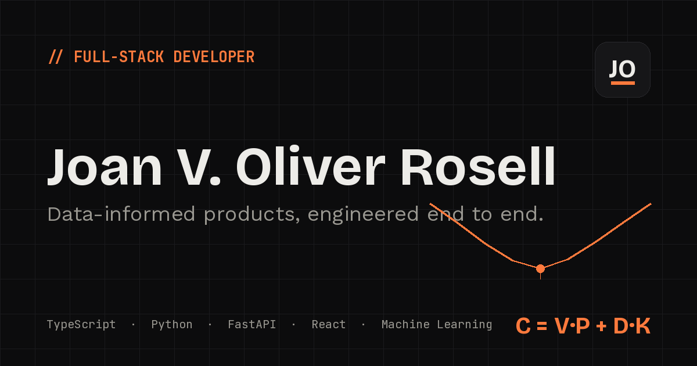

# Joan V. Oliver Rosell — Portfolio



Personal portfolio of a full-stack developer based in Valencia, Spain, focused on
data-informed products — TypeScript, Python and applied AI.

**Live Demo:** <https://joan-portfolio-alpha.vercel.app>

**Open to my first full-time software role.**
[LinkedIn](https://www.linkedin.com/in/joanvoliver) ·
[GitHub](https://github.com/JoanOliver04) ·
[joanoliverrosell@gmail.com](mailto:joanoliverrosell@gmail.com)

**Stack:** Next.js 15 (App Router) · TypeScript · Tailwind CSS

Bilingual (English/Spanish) · light/dark themes · accessible · SEO and Open Graph
ready · no server, no database, no environment variables.

---

## Featured work

The site presents five complete projects, each with a screenshot gallery, a problem
statement and engineering highlights:

| Project | What it is | Stack |
| --- | --- | --- |
| [Data Fuel](https://github.com/JoanOliver04/Data_Fuel) | Find the cheapest fill-up by **total cost** (fuel + the drive), with explainable ML price forecasts — 690 tests, 86% coverage | FastAPI · React · scikit-learn · SHAP |
| [FitPrompt](https://github.com/JoanOliver04/FitPrompt) | Conversational AI coach that turns a real user profile into training and nutrition plans — team project, 2 developers | Next.js · Prisma · Groq / Llama 3.3 · Stripe |
| [Data Detective](https://github.com/JoanOliver04/Data_Detective) | Quasi-experimental measurement of how mass events move Valencia's air quality — 123 tests, 90% coverage, CI | Python · pandas · Streamlit |
| [Book Piece](https://github.com/JoanOliver04/book-piece-showcase) | Marketplace and reading companion for books, comics and manga | Angular · PHP · MySQL |
| [Brain Craft](https://github.com/JoanOliver04/brain-craft-showcase) | Trivia quiz reimagined as a turn-based RPG | Vanilla JS · Firebase |

---

## Engineering notes

The portfolio itself is built with the same care as the projects it presents:

- **Typed bilingual content.** Every string lives in `src/content/` as data, not
  markup. English is authored first and the Spanish dictionary is type-checked
  against it (`const es: Dictionary`), so the two languages can never fall out
  of sync.
- **Static-first.** No server code, no database, no environment variables — the
  whole site prerenders at build time and hosts for free on Vercel (and is
  exportable to any static host).
- **Accessible by default.** Semantic landmarks, skip link, keyboard-navigable
  galleries, visible focus states and `prefers-reduced-motion` support.
- **Design tokens.** The palette is defined once as CSS variables in
  `src/app/globals.css` (light and dark) and surfaced to Tailwind, so themes
  stay consistent without per-component color logic.
- **Honest content.** Metrics shown on the site are only those documented in
  each project's own repository.

---

## Running locally

Requires **Node.js ≥ 20**.

```bash
npm install
npm run dev
```

Open <http://localhost:3000>. `npm run build` produces the production build;
`npm run lint` runs ESLint.

---

## Structure

```
src/
├── app/          Root layout, page, global styles, SEO/OG metadata
├── components/   Sections, project cards and galleries, UI primitives
├── content/      All copy — typed, bilingual (EN/ES)
├── i18n/         Language provider + persistence
└── hooks/ lib/ types/
```

---

## License

© Joan V. Oliver Rosell. All rights reserved. This is a personal site, not a
template — but the code is public and readable if it's useful as a reference.
